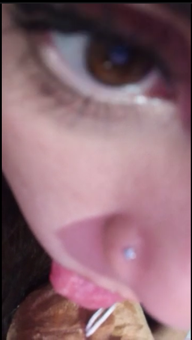
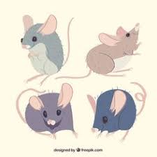
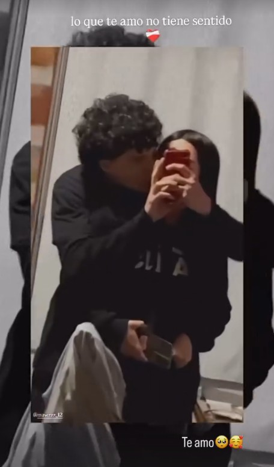

<html>
    <head>
        <title>Presentacion de mi mujer</title>
        <body 
        align="middle"
        bgcolor="pink"
    >
    </head>
    <body>
        

        <h1>
            ¡Les presento a mi mujer Hermosa!
        </h1>

        
        <h2>Su nombre es: Daiana Antonella Contreras</h2>
         
        

         <h1>¡Es el amor de mi vida y la mujer que amo con todo mi corazon!</h1> 
        

        

            <h3>Tiene 22 años recien cumplidos.  
            Ella es de Neuquen, actualmente vive en la capita,yo estoy a 50km de ella T_T toy muy lejitos  
            Aun asi la voy a ver seguido :D(eso me pone feliz).
            Es bajita mide casi 1,60 metros  
            Tiene el pelo negro rojiso  
            Los ojos mas unicos y hermosos que no me canso de mirar (inserto pruebas)  
             
            tiene una nariz perfecta  
            

            <h1>¡ELLA ES PERFECTA PARA MI!</h1>
            

            Le gustan los perritos salchichas  
            el color violeta  
            tambien tiene 4 ratitas  
            miren  
              

            sueña con tener un perrito chihuahua como el del inicio pero de color blanco (quiero regalarselo pero ustedes hagan de cuenta que no se los dije)  
            le gusta conocer lugares nuevos  
            se baña todos los dias(excepto ayer)  
            esto es un poco de ella no pongo mas xq quiere ver ajaja dps les sigo contando  
            </h3>
        
     

        
            <h1>Nos conocimos en julio(por el 20 masomenos casi fin de mes) por instagram y decidimos vernos en persona  
            </h1>
            <h2>
                Una semana despues nos conocimos en Persona un 1 agosto de 2025  
                <h1> En el instante que la vi supe que era ella la personita que voy a amar para toda mi vida y no quiero separarme jamas de su lado </h1> 
                <h2>Ese dia llovio no mucho pero si jaja  
                Tomamos mates (su primera vez tomando jajs me agarro la bombilla y la uso como palanca de cambios >:|)  
                Ella llevo torta de chocolate  
                nos reimos todo el dia y supe q era donde yo siempre voy a querer estar que es ella  
                tambien nos vieron personas que iban a conocer la plaza de las banderas  
                Despues fuimos a otra plaza xq nos cansamos y fue ahi donde nos dimos nuestros primer beso yo todo nervioso y ella riendose con esa sonrisa hermosa que tiene    
                <h1>Fue ahi donde prometimos que seria para siempre</h1> 
                

                    <strong> Y bueno ya dejo esta foto aca porque ya se esta aburriendo mi amor jeje(foto de nosotros 2)</strong> 
                    
                    <h1>¡TE AMO DAINA CON TODA MI ALMA!</h1>

                

            </h2>

    

    </body>
</html>
